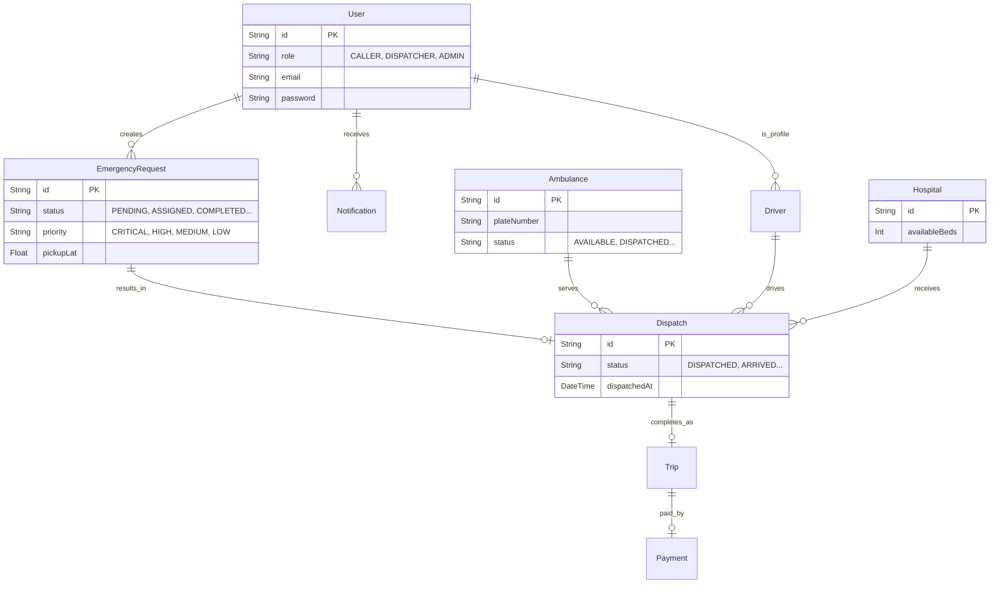

# Emergency Ambulance Dispatch System

## 📖 Project Overview & Problem Domain
The **Emergency Ambulance Dispatch System** is a robust, mission-critical backend service designed to handle the life-saving logistics of ambulance deployment. In emergencies, every second counts. This system solves the complex problem of bridging callers in distress with the nearest available medical transport while guaranteeing **transaction safety** so that an ambulance is never double-booked. 

It manages the entire lifecycle of an emergency—from the initial distress call, through dispatcher queueing and algorithmic nearest-ambulance matching (via Haversine), strictly-enforced trip status updates by drivers, to hospital bed reservation and final Stripe payment processing.

## 🛠 Tech Stack
- **Runtime Environment:** Node.js (v18+)
- **Framework:** Express.js (TypeScript)
- **Database ORM:** Prisma
- **Database Engine:** PostgreSQL (Hosted on Supabase via connection poolers)
- **Caching & Rate Limiting:** Redis / ioredis
- **Validation:** Zod
- **Authentication:** JSON Web Tokens (JWT)
- **Payments:** Stripe
- **Security:** Helmet, express-rate-limit, cors

## 👥 Roles & Permissions
The system employs a strict Role-Based Access Control (RBAC) architecture using the `@requireRole` middleware.

1. **CALLER**: 
   - Can create emergency requests and track their own requests.
   - Can cancel a request (only if still `PENDING`).
   - Can initiate payments for their completed trips via Stripe.
   - Can view personal notifications.
2. **DISPATCHER**: 
   - Can view the prioritized emergency queue.
   - Can perform the critical action of **assigning** an ambulance to a request.
   - Can update trip statuses on behalf of the driver (or as the driver).
   - Can reserve hospital beds.
   - Can search and filter all dispatches.
3. **ADMIN**: 
   - Has overarching access to all dispatcher features.
   - Can manage users, hospitals, drivers, and ambulances (CRUD).
   - Can access the Admin Dashboard for analytics (active trips, response times, utilization).
   - Can view immutable Audit Logs and Incident History.

## 📊 Entity Relationship Diagram (ERD)


## 🌐 API Endpoints

### Auth Module
- `POST /api/v1/auth/register` - Register a new user
- `POST /api/v1/auth/login` - Authenticate and receive JWT
- `POST /api/v1/auth/refresh-token` - Refresh JWT session
- `POST /api/v1/auth/logout` - Invalidate refresh token

### Users Module
- `GET /api/v1/users/profile` - Get current user profile
- `PATCH /api/v1/users/profile` - Update profile

### Ambulances Module
- `POST /api/v1/ambulances` - Create an ambulance (Admin)
- `GET /api/v1/ambulances` - List ambulances (Redis cached if `?status=AVAILABLE`)
- `GET /api/v1/ambulances/nearest` - Find nearest available via Haversine distance
- `PATCH /api/v1/ambulances/:id` - Update ambulance (Admin)
- `DELETE /api/v1/ambulances/:id` - Soft delete ambulance (Admin)

### Hospitals Module
- `POST /api/v1/hospitals` - Create hospital (Admin)
- `GET /api/v1/hospitals` - List hospitals
- `GET /api/v1/hospitals/:id` - Get specific hospital
- `PATCH /api/v1/hospitals/:id` - Update hospital (Admin)
- `DELETE /api/v1/hospitals/:id` - Soft delete hospital (Admin)

### Drivers Module
- `POST /api/v1/drivers` - Create driver profile (Admin)
- `GET /api/v1/drivers` - List drivers (Dispatcher/Admin)
- `GET /api/v1/drivers/:id` - Get driver details
- `PATCH /api/v1/drivers/:id` - Update driver (Admin)
- `DELETE /api/v1/drivers/:id` - Soft delete driver (Admin)

### Requests Module
- `POST /api/v1/requests` - Create emergency request (Caller)
- `GET /api/v1/requests` - List all requests (Dispatcher/Admin)
- `GET /api/v1/requests/queue` - Get PENDING prioritized dispatch queue (Dispatcher/Admin)
- `GET /api/v1/requests/my` - Get own requests (Caller)
- `GET /api/v1/requests/:id` - Get specific request
- `PATCH /api/v1/requests/:id/cancel` - Cancel a PENDING request (Caller)

### Dispatch Module
- `POST /api/v1/requests/:id/assign` - Assign ambulance to request (Transaction safe) (Dispatcher)
- `PATCH /api/v1/dispatches/:id/status` - Strictly validate and update trip state machine (Dispatcher)
- `POST /api/v1/dispatches/:id/select-hospital` - Atomically reserve a bed (Dispatcher)
- `GET /api/v1/dispatches/search` - Search by plate or patient name
- `GET /api/v1/dispatches/my-assigned` - Get current driver's dispatches
- `GET /api/v1/dispatches/:id` - Get specific dispatch

### Payments Module
- `POST /api/v1/payments/initiate` - Create Stripe Checkout Session (Caller)
- `GET /api/v1/payments/:id` - Get payment status
- `POST /api/v1/payments/webhook` - Raw-body Stripe webhook handler for status updates

### Notifications Module
- `GET /api/v1/notifications/my` - Get own notifications
- `PATCH /api/v1/notifications/:id/read` - Mark notification as read

### Admin Module
- `GET /api/v1/admin/dashboard-stats` - View active trips, utilization, and response times
- `GET /api/v1/admin/users` - View paginated users
- `PATCH /api/v1/admin/users/:id/role` - Change a user's role
- `GET /api/v1/admin/audit-logs` - View immutable audit trail
- `GET /api/v1/admin/incident-history` - View historical incident data

## 🚀 Setup Instructions (Local Dev)
1. **Clone the repository.**
2. **Install dependencies:**
   ```bash
   npm install
   ```
3. **Configure Environment:**
   Copy `.env.example` to `.env` and fill in your Supabase connection strings, Redis URL, and Stripe keys.
   ```bash
   cp .env.example .env
   ```
4. **Push Prisma Schema:**
   Sync the database schema with your Supabase PostgreSQL instance.
   ```bash
   npx prisma db push
   ```
5. **Generate Prisma Client:**
   ```bash
   npx prisma generate
   ```
6. **Run Development Server:**
   ```bash
   npm run dev
   ```

## 🌍 Deployment Instructions
1. Build the TypeScript source code:
   ```bash
   npm run build
   ```
2. Set up environment variables on your hosting provider (Vercel, Render, Heroku).
3. Ensure you use the `DIRECT_URL` for running migrations in CI/CD (`npx prisma migrate deploy`).
4. Start the server using the compiled output:
   ```bash
   npm start
   ```

## 🔐 Environment Variables
| Variable | Description |
|---|---|
| `PORT` | The port the server runs on (e.g., 5000) |
| `NODE_ENV` | `development` or `production` |
| `DATABASE_URL` | Transaction-mode connection string for Prisma |
| `DIRECT_URL` | Session-mode connection string for migrations |
| `JWT_SECRET` | Secret key for signing JSON Web Tokens |
| `JWT_EXPIRES_IN` | Token expiration time (e.g., `1h`) |
| `REDIS_URL` | Connection string for your Redis instance |
| `STRIPE_SECRET_KEY` | Your Stripe secret key (`sk_test_...`) |
| `STRIPE_WEBHOOK_SECRET` | Secret for verifying webhook payloads (`whsec_...`) |

## 🧪 Admin Demo Credentials for Evaluators
To explore the system fully, you can seed the database with an admin user, or simply register a user and manually change their role to `ADMIN` inside Supabase/Prisma Studio (`npx prisma studio`). 
*(Note: A production environment should never expose an admin creation route publicly).*

## 📬 Postman Collection
The complete Postman Collection (JSON export) covering all endpoints, authentication flows, and failure cases is located at the root of the project:
`./Postman_Collection.json`

You can easily import this file directly into your Postman workspace.

## ⚠️ Known Limitations / Future Improvements
- **WebSockets / Real-time tracking:** Currently, the frontend must poll for ambulance location updates. Future improvements should integrate Socket.io or Supabase Realtime for live GPS tracking.
- **Route Optimization API:** The Haversine formula calculates straight-line distance. Integrating Google Maps Directions API would yield more accurate arrival times considering traffic.
- **Microservices Architecture:** As the system scales globally, the Dispatch, Payment, and Notification modules could be decoupled into independent microservices.
